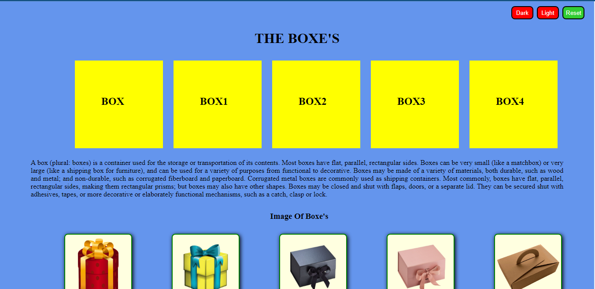
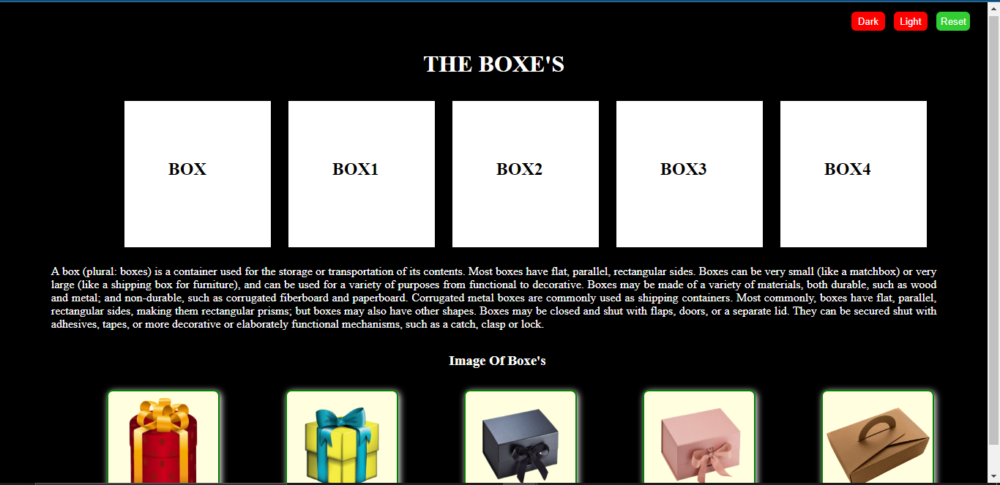
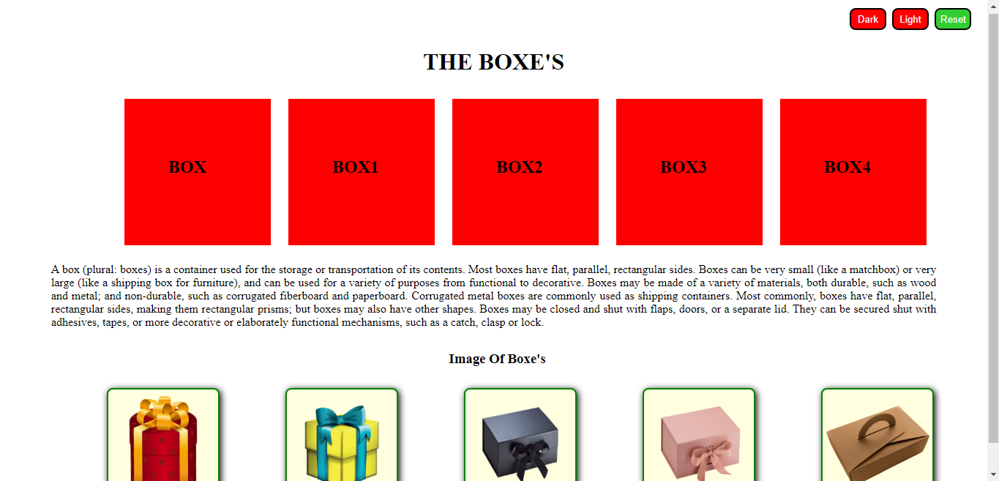

# CSS-Variable
<h1>Reset Mode</h1>

<h1>DARK MODE</h1>

<h1>LIGHT MODE</h1>
\

<h1>Live Demo</h1>
https://shamilamim.github.io/CSS-Variable/cssvariable.html

<h1>Source Code</h1>
https://github.com/ShamilaMim/CSS-Variable/blob/main/cssvariable.html
